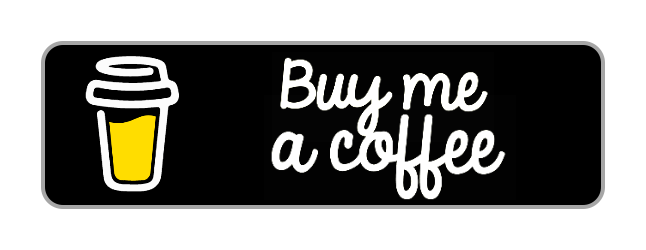

  

 
 
<h3>
   Hello, and Welcome!
</h3>

My name is **William**,\
I'm a **Software Engineer** and **Full-Stack Developer**, currently studying **Computer Science** and working at [KTH](https://www.kth.se/) in **Sweden** :sweden:.
Sitting board member of the computer club [Stacken](http://stacken.kth.se/) and member of the ACM Special Interest Group on Programming Languages. 

I create awesome Open-Source Software, Tools and Apps for developers. My large set of projects includes the [Lento language](https://github.com/Lento-lang), [RustScript language](https://github.com/WilliamRagstad/RustScript), [APC Library](https://github.com/APCLib) and [Font Manager](https://github.com/WilliamRagstad/Font-Manager) — having more than **90k downloads!** 🎉

<!--
- 🔭 I’m currently working on ...
- 🌱 I’m currently learning ...
- 👯 I’m looking to collaborate on ...
- 🤔 I’m looking for help with ...
- 📫 How to reach me: ...
-->

- 🔭 I’m currently working on **[Lento](https://github.com/Lento-lang)** and **[RustScript](https://github.com/WilliamRagstad/RustScript)**.
- ❤ I love building **compilers** and **interpreters**!
- ⚡ Fun fact: **I play the cello🎻**

 

  
  &nbsp;&nbsp;&nbsp;
  
  &nbsp;&nbsp;
  
  &nbsp;&nbsp;&nbsp;&nbsp;
  
  &nbsp;&nbsp;&nbsp;&nbsp;
  
  &nbsp;&nbsp;&nbsp;&nbsp;
  
  &nbsp;&nbsp;&nbsp;&nbsp;&nbsp;
  

  

  <h3>View all of my Gists on:</h3>
  

  

---

  
GitHub Statistics

    
  

    
    
     
    
      
    <a href="https://profile-summary-for-github.com/user/WilliamRagstad">Profile summary</a>
  

---

  
Sponsors and Donations

    

### 💖 Become a Sponsor
Open source **software takes a lot of time to create** and maintain! You can help me create better developer experiences, or simply say thank you for existing projects.
*With your support*, I will be able to **continue to develop Open-Source Software** projects for the *community*!
**Consider supporting me** and my work along the way. With my ideas and your support, nothing is impossible!

#### 🍰 Perks
You will be **personally be mentioned** in all my future popular projects as well as being able to directly influence my work! But not only that, you will also receive one of **GitHub's sponsor badges**🎉

#### ⚡ Stats
Each sponsorship has a **x2** effect on Williams' **work pace** and a **x100** increase in **confidence**!

 
  &nbsp;
 
 

  

---

  
Resume

  

    <a href="https://resume-github.vercel.app/WilliamRagstad">Github Resume</a> | 
    <a href="https://resume.io/r/qnQGASSSD">Professional Resume (Long)</a> | 
    <a href="https://rxresu.me/r/mref66">Professional Resume (Short)</a>
  

   

---

  

#### Languages I ❤

<!-- All icons: https://simpleicons.org/ or https://ileriayo.github.io/markdown-badges/-->

  
  
  
  
  
  

#### Languages I 🧠

  
  
  
  
  
  
  
  
  
  
  
  

#### Technologies I've worked with ⚡

  
  
  
  
  
  
  
  
  
  
  
  
  
  
  
  
  
  
  
  
  
   
  And much more...

#### Follow me on my social media 🤖

  
  
  
  

OR visit me on [my website](https://www.williamragstad.com/) if you'd like to get to know me more.

  

    

